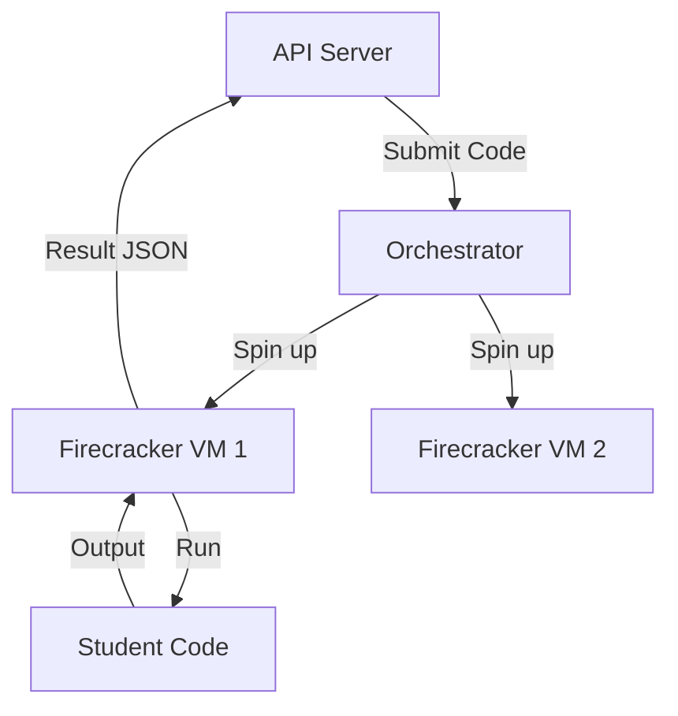

# Progy Roadmap: The Future of Interactive Coding

**Version:** 0.1.0-alpha
**Status:** DRAFT
**Author:** Jules (AI Assistant)
**Date:** 2024-05-18

This document outlines a comprehensive, visionary roadmap for the Progy platform. It details potential features, architectural improvements, and strategic directions to transform Progy from a CLI tool into a complete ecosystem for interactive coding education.

The features described herein are proposals based on the current system architecture (Bun, React, Hono, Drizzle/D1) and aim to leverage modern technologies like WebRTC, AI, and Cloud integration.

---

## 📚 Table of Contents

1.  [Executive Summary](#executive-summary)
2.  [The Four Pillars of Evolution](#the-four-pillars-of-evolution)
3.  [Feature A: Real-time AI Voice Companion (Project: Jarvis)](#feature-a-real-time-ai-voice-companion-project-jarvis)
    -   [Problem Statement](#problem-statement-a)
    -   [Proposed Solution](#proposed-solution-a)
    -   [User Experience (UX) Flow](#user-experience-ux-flow-a)
    -   [Technical Architecture (WebRTC)](#technical-architecture-webrtc-a)
    -   [Implementation Details](#implementation-details-a)
    -   [Pros & Cons](#pros--cons-a)
4.  [Feature B: CLI 2.0 - The Interactive TUI](#feature-b-cli-20---the-interactive-tui)
    -   [Problem Statement](#problem-statement-b)
    -   [Proposed Solution](#proposed-solution-b)
    -   [Mockups & UX](#mockups--ux-b)
    -   [Technical Architecture](#technical-architecture-b)
5.  [Feature C: Smart Runners & Deep Diagnostics](#feature-c-smart-runners--deep-diagnostics)
    -   [Problem Statement](#problem-statement-c)
    -   [Proposed Solution](#proposed-solution-c)
    -   [Runner Protocol v2](#runner-protocol-v2)
6.  [Feature D: Progy Cloud & Deployment](#feature-d-progy-cloud--deployment)
    -   [Problem Statement](#problem-statement-d)
    -   [Proposed Solution](#proposed-solution-d)
    -   [Architecture](#architecture-d)
7.  [Feature E: Social Coding & Multiplayer](#feature-e-social-coding--multiplayer)
    -   [Problem Statement](#problem-statement-e)
    -   [Proposed Solution](#proposed-solution-e)
8.  [Feature F: Content Ecosystem & Studio](#feature-f-content-ecosystem--studio)
    -   [Problem Statement](#problem-statement-f)
    -   [Proposed Solution](#proposed-solution-f)
9.  [Feature G: The RPG Engine (Gamification 2.0)](#feature-g-the-rpg-engine-gamification-20)
    -   [Problem Statement](#problem-statement-g)
    -   [Proposed Solution](#proposed-solution-g)
    -   [Skill Trees & Mechanics](#skill-trees--mechanics)
10. [Feature H: Enterprise & Education (LMS)](#feature-h-enterprise--education-lms)
    -   [Problem Statement](#problem-statement-h)
    -   [Proposed Solution](#proposed-solution-h)
    -   [LTI & SSO](#lti--sso)
11. [Feature I: Advanced Security & Sandboxing](#feature-i-advanced-security--sandboxing)
    -   [Problem Statement](#problem-statement-i)
    -   [Proposed Solution](#proposed-solution-i)
    -   [Firecracker Architecture](#firecracker-architecture)
12. [Feature J: Plugin Architecture](#feature-j-plugin-architecture)
    -   [Problem Statement](#problem-statement-j)
    -   [Proposed Solution](#proposed-solution-j)
13. [Smart Runner Implementations (Detailed Specs)](#smart-runner-implementations-detailed-specs)
    -   [Rust (Cargo JSON)](#rust-cargo-json)
    -   [TypeScript (Jest/ESLint)](#typescript-jesteslint)
    -   [Go (Staticcheck)](#go-staticcheck)
    -   [Python (PyTest/Pylint)](#python-pytestpylint)
14. [Accessibility & Inclusion (A11y)](#accessibility--inclusion-a11y)
    -   [Screen Reader Support](#screen-reader-support)
    -   [High Contrast & Color Blindness](#high-contrast--color-blindness)
15. [Internationalization (i18n)](#internationalization-i18n)
    -   [Platform Translation](#platform-translation)
    -   [Course Translation](#course-translation)
16. [Pedagogy & Course Design Guide](#pedagogy--course-design-guide)
    -   [Spiral Learning](#spiral-learning)
    -   [Cognitive Load Theory](#cognitive-load-theory)
17. [UX Design System (Progy UI)](#ux-design-system-progy-ui)
    -   [Color Palette](#color-palette)
    -   [Typography](#typography)
    -   [Component Library](#component-library)
18. [Contribution Guide (Expanded)](#contribution-guide-expanded)
    -   [Repo Setup](#repo-setup)
    -   [Development Workflow](#development-workflow)
19. [Appendix: Frequently Asked Questions (FAQ)](#appendix-frequently-asked-questions-faq)
20. [Appendix: Quarterly Roadmap](#appendix-quarterly-roadmap)
21. [Conclusion](#conclusion)

---

## 1. Executive Summary <a name="executive-summary"></a>

Progy is currently a robust CLI tool for running local coding courses. However, the landscape of developer education is shifting towards:
1.  **Immersive AI Assistance:** Beyond chat, users want real-time voice guidance while they code.
2.  **Interactive Terminals:** Users expect rich TUIs (Terminal User Interfaces) rather than simple command-response loops.
3.  **Community & Cloud:** Learning is social. Deployment is essential.

This roadmap proposes transforming Progy into a "Learning OS" for developers. The most ambitious feature is the **Real-time AI Voice Companion**, which uses OpenAI's Realtime API (WebRTC) to allow students to *talk* to their course material as if a tutor were sitting next to them.

---

## 2. The Four Pillars of Evolution <a name="the-four-pillars-of-evolution"></a>

To structure our efforts, we categorize features into four pillars:

1.  **Intelligence (AI):** Making the platform smarter, context-aware, and conversational.
2.  **Experience (UX/DX):** Improving how users interact with the CLI and Web UI.
3.  **Connectivity (Cloud/Social):** Bridging local environments with the cloud and community.
4.  **Content (Ecosystem):** Empowering creators to build richer, more complex courses.

---

## 3. Feature A: Real-time AI Voice Companion (Project: Jarvis) <a name="feature-a-real-time-ai-voice-companion-project-jarvis"></a>

### Problem Statement <a name="problem-statement-a"></a>

Current AI assistance in coding platforms is text-based (chatbots). This breaks the flow:
- Users must switch context from writing code to typing a question.
- Users often struggle to articulate technical problems in text ("Why is this red squiggle here?").
- Text responses can be verbose and hard to parse while coding.
- Pronunciation of technical terms is often ambiguous for beginners.

Students need a "pair programmer" experience where they can speak naturally ("Wait, what does that error mean?") and get an immediate, conversational response without leaving their editor or terminal.

### Proposed Solution <a name="proposed-solution-a"></a>

Implement a **Real-time Voice Mode** in the Progy Web UI (and optionally CLI via system audio).
Using OpenAI's Realtime API over WebRTC, the system will:
1.  Listen to the user's voice constantly (VAD - Voice Activity Detection).
2.  Maintain a context of the *current file*, *current error*, and *course lesson*.
3.  Respond with low-latency audio (<300ms) to answer questions, explain concepts, or guide the user.

This is not just "Speech-to-Text -> LLM -> Text-to-Speech". It is a native audio-to-audio model that understands tone, interruptions, and non-verbal cues.

### User Experience (UX) Flow <a name="user-experience-ux-flow-a"></a>

**Scenario: A student is learning Rust ownership.**

1.  **Activation:**
    - User clicks a "🎙️ Start Session" button in the Progy Web UI.
    - A subtle waveform visualizer appears in the corner.
    - AI: "Hi there! Ready to tackle the borrow checker?"

2.  **Coding & Interaction:**
    - User types code and gets a compiler error.
    - User (speaking): "Ugh, it says 'cannot borrow as mutable'. What did I do wrong?"
    - AI (immediately): "Ah, classic. You defined `my_vec` as immutable on line 4. Try adding `mut` before the variable name."

3.  **Context Awareness:**
    - User highlights a block of code.
    - User: "Is there a better way to write this loop?"
    - AI: "Yes! Since you're just iterating over values, you could use a `for` loop or an iterator like `.iter()` instead of a `while` loop."

4.  **Interruptions:**
    - AI starts explaining a long concept.
    - User: "Okay, I get it, thanks."
    - AI (stops immediately): "Cool. Let's move on."

### Technical Architecture (WebRTC) <a name="technical-architecture-webrtc-a"></a>

We will use the **Unified Interface** approach described in `OPENAI_REALTIME.md` to keep API keys secure on the backend while maintaining low latency.

#### High-Level Diagram

```mermaid
sequenceDiagram
    participant Browser (Web UI)
    participant Backend (Hono/Node)
    participant OpenAI (Realtime API)

    Note over Browser: User clicks "Start Voice"
    Browser->>Browser: Init RTCPeerConnection
    Browser->>Browser: Create SDP Offer
    Browser->>Backend: POST /api/realtime/session (SDP Offer)

    Note over Backend: Authenticate User
    Backend->>OpenAI: POST /v1/realtime/calls (SDP + Config)
    OpenAI-->>Backend: SDP Answer
    Backend-->>Browser: SDP Answer

    Note over Browser: Set Remote Description
    Browser<->OpenAI: WebRTC Peer Connection (Audio Stream)

    loop Context Updates
        Browser->>OpenAI: Data Channel: { type: "session.update", ...file_content }
    end

    loop Events
        OpenAI->>Browser: Data Channel: { type: "response.audio_transcript.done", ... }
    end
```

#### Components

1.  **Frontend (React/Web UI):**
    -   `useWebRTC` hook: Manages the `RTCPeerConnection`.
    -   **Audio Handling:** Captures microphone stream (`navigator.mediaDevices.getUserMedia`).
    -   **Data Channel:** Sends "context events" (e.g., when the user saves the file or compilation fails, send the new code/error to the model as a text event).
    -   **Visualizer:** Renders the audio frequency data on a canvas.

2.  **Backend (Hono):**
    -   **Endpoint:** `POST /api/realtime/session`.
    -   **Role:** Acts as the signaling server. It receives the browser's SDP offer, injects the OpenAI API Key (server-side only), and forwards the request to OpenAI. It returns the SDP Answer.
    -   **Security:** Ensures only authenticated Progy users can start a session (rate limiting is crucial here due to cost).

3.  **Context Management:**
    -   The AI needs to know *what* the user is looking at.
    -   **Strategy:** Whenever the file content changes (debounced) or a runner execution finishes, the frontend sends a `conversation.item.create` event over the WebRTC data channel containing the code or error logs as a hidden system message.

### Implementation Details <a name="implementation-details-a"></a>

#### 1. Backend Signaling Endpoint (`apps/backend/src/api/realtime.ts`)

```typescript
import { Hono } from "hono";

const app = new Hono();

app.post("/session", async (c) => {
    const sdp = await c.req.text(); // Raw SDP from browser

    // Configuration for the session
    const sessionConfig = {
        modalities: ["audio", "text"],
        instructions: `
            You are Progy, a helpful, friendly coding tutor.
            You are helping a student with a coding exercise.
            Be concise. Encourage the student.
            If they are stuck, give hints, not answers.
            Speak with a warm, energetic tone.
        `,
        voice: "alloy", // or "shimmer", "echo"
        input_audio_format: "pcm16",
        output_audio_format: "pcm16",
    };

    const response = await fetch("https://api.openai.com/v1/realtime/calls", {
        method: "POST",
        headers: {
            "Authorization": \`Bearer \${process.env.OPENAI_API_KEY}\`,
            "Content-Type": "application/sdp"
        },
        body: sdp // Send the browser's offer directly
    });

    if (!response.ok) {
        return c.json({ error: "Failed to connect to OpenAI" }, 500);
    }

    const answerSdp = await response.text();
    return c.text(answerSdp, 200, { "Content-Type": "application/sdp" });
});

export default app;
```

#### 2. Frontend Hook (`apps/web/src/hooks/useRealtime.ts`)

```typescript
import { useEffect, useRef, useState } from "react";

export function useRealtime() {
    const pcRef = useRef<RTCPeerConnection | null>(null);
    const dcRef = useRef<RTCDataChannel | null>(null);
    const [isConnected, setIsConnected] = useState(false);

    const startSession = async () => {
        const pc = new RTCPeerConnection();
        pcRef.current = pc;

        // Setup Audio
        const stream = await navigator.mediaDevices.getUserMedia({ audio: true });
        stream.getTracks().forEach(track => pc.addTrack(track, stream));

        // Setup Remote Audio Playback
        const remoteAudio = new Audio();
        remoteAudio.autoplay = true;
        pc.ontrack = (e) => remoteAudio.srcObject = e.streams[0];

        // Setup Data Channel for Context
        const dc = pc.createDataChannel("oai-events");
        dcRef.current = dc;

        // Signaling
        const offer = await pc.createOffer();
        await pc.setLocalDescription(offer);

        const res = await fetch("/api/realtime/session", {
            method: "POST",
            body: offer.sdp,
            headers: { "Content-Type": "application/sdp" }
        });

        const answerSdp = await res.text();
        await pc.setRemoteDescription({ type: "answer", sdp: answerSdp });

        setIsConnected(true);
    };

    const sendContext = (code: string, error?: string) => {
        if (!dcRef.current || dcRef.current.readyState !== "open") return;

        const event = {
            type: "conversation.item.create",
            item: {
                type: "message",
                role: "system",
                content: [{
                    type: "input_text",
                    text: \`CURRENT CODE:\n\${code}\n\nLAST ERROR:\n\${error || "None"}\`
                }]
            }
        };
        dcRef.current.send(JSON.stringify(event));

        // Trigger a response generation based on this new context if needed
        // dcRef.current.send(JSON.stringify({ type: "response.create" }));
    };

    return { startSession, sendContext, isConnected };
}
```

### Pros & Cons <a name="pros--cons-a"></a>

**Pros:**
- **Engagement:** Extremely high "wow" factor. Feels personal.
- **Accessibility:** Helps users who prefer auditory learning or have difficulty typing.
- **Speed:** Verbal communication is often faster than typing for complex queries.

**Cons:**
- **Cost:** Realtime API is expensive (per minute). Requires strict quotas/tiering (e.g., Pro users only).
- **Privacy:** Users may be uncomfortable with an "always-on" microphone. (Must have clear mute/unmute UI).
- **Latency Sensitivity:** Requires good internet connection.


---

## 4. Feature B: CLI 2.0 - The Interactive TUI <a name="feature-b-cli-20---the-interactive-tui"></a>

### Problem Statement <a name="problem-statement-b"></a>

The current CLI (`progy start`, `progy run`) is functional but passive. It starts a server and waits.
Users who prefer staying in the terminal (NeoVim/Emacs users) get a degraded experience compared to the Web UI. They miss out on progress bars, rich diffs, and formatted lesson content.

### Proposed Solution <a name="proposed-solution-b"></a>

Develop a **Terminal User Interface (TUI)** mode for the CLI.
When running `progy start --tui`, the terminal takes over the full screen.

**Tech Stack:** `ink` (React for CLI) or `ratatui` (Rust) if we migrate the runner. Given the current stack is Bun/TS, `ink` is the natural choice.

### Mockups & UX <a name="mockups--ux-b"></a>

**Layout:**
```
+---------------------------+-----------------------------------+
|  MODULE: Rust Basics      |  FILE: exercises/01_intro.rs      |
|  Exercise: 05_variables   |                                   |
|                           |  fn main() {                      |
|  [Instructions]           |      let x = 5;                   |
|  In this exercise, you    |      println!("x is {}", x);      |
|  must make the variable   |  }                                |
|  mutable...               |                                   |
|                           |                                   |
+---------------------------+-----------------------------------+
|  TEST OUTPUT              |  STATUS: FAILED ❌                |
|                           |                                   |
|  error[E0384]: cannot     |  [R]un Again   [N]ext Exercise    |
|  assign twice to          |  [H]int        [Q]uit             |
|  immutable variable `x`   |                                   |
+---------------------------+-----------------------------------+
```

### Technical Architecture <a name="technical-architecture-b"></a>

1.  **Framework:** Use `ink` to build React components that render to stdout.
2.  **State Management:** Use `zustand` or `jotai` (same as web) to manage the course state.
3.  **File Watcher:** The TUI must watch the file system (using `chokidar` or Bun's watcher) to auto-rerun tests when the user saves in their external editor.
4.  **Editor Integration:**
    -   The TUI is *not* a text editor.
    -   It displays the file content (read-only) for context.
    -   It provides a command to open the current file in ``.

---

## 5. Feature C: Smart Runners & Deep Diagnostics <a name="feature-c-smart-runners--deep-diagnostics"></a>

### Problem Statement <a name="problem-statement-c"></a>

Currently, runners execute tests and report pass/fail status with stdout/stderr.
This is brittle:
- Parsing raw compiler output (regex) is error-prone.
- The UI can't easily highlight the *exact* line of code that caused the error.
- Users have to manually decipher cryptic error messages.

### Proposed Solution <a name="proposed-solution-c"></a>

Upgrade the **Runner Protocol** to `v2` to support structured diagnostics and auto-fixes.

### Runner Protocol v2 <a name="runner-protocol-v2"></a>

The runner output JSON `SRPOutput` should be expanded:

```typescript
type SRPOutputV2 = {
  version: "2.0";
  success: boolean;
  diagnostics: Array<{
    severity: "error" | "warning" | "info";
    file: string;
    range: { start: { line: number, col: number }, end: { line: number, col: number } };
    message: string;
    code?: string; // e.g., "E0384"
    source?: "compiler" | "linter";
    // Suggestions for Quick Fixes
    fix?: {
      description: string;
      replacements: Array<{
        range: { start: { line: number, col: number }, end: { line: number, col: number } };
        text: string;
      }>;
    };
  }>;
  tests: Array<{
    name: string;
    status: "pass" | "fail" | "skip";
    duration_ms: number;
    expected?: string;
    actual?: string;
  }>;
}
```

#### Key Capabilities:

1.  **Inline Decorations:** The UI can draw red squiggles exactly where the error is.
2.  **Auto-Fix Button:** If the runner provides a `fix` object (e.g., `clippy --fix` output in Rust), the UI can show a "✨ Fix this" button.
3.  **Rich Diffs:** When a test fails on assertion, the `expected` vs `actual` fields allow the UI to show a rich side-by-side diff.

#### Implementation Strategy

- **Rust Runner:** Already parses JSON from `cargo test`. Enhance it to extract `suggestions` from `cargo check --message-format=json`.
- **Node Runner:** Use `eslint` output for diagnostics and `jest` JSON reporter for tests.
- **Go Runner:** Parse `go test -json` and use `staticcheck -json`.

---

## 6. Feature D: Progy Cloud & Deployment <a name="feature-d-progy-cloud--deployment"></a>

### Problem Statement <a name="problem-statement-d"></a>

Students often build full applications (Web Servers, APIs) during a course.
Running them on `localhost:3000` is fine for development, but they miss the crucial skill of **deployment**.
"It works on my machine" is a common anti-pattern.

### Proposed Solution <a name="proposed-solution-d"></a>

Introduce `progy deploy` (and `progy.deploy` in `course.json`).
This allows students to deploy their exercise result to a real cloud environment with a single command.

### Architecture <a name="architecture-d"></a>

We will not build a cloud provider from scratch. We will wrap existing serverless platforms.

**Target Providers:**
1.  **Cloudflare Workers:** (Perfect for JS/Rust/Wasm). Free tier is generous.
2.  **Fly.io:** (For Docker containers).
3.  **Deno Deploy:** (For TS/JS).

#### Workflow

1.  **Course Definition:**
    ```json
    // course.json
    "deploy": {
      "provider": "cloudflare",
      "entry": "src/worker.ts",
      "compatibility_date": "2024-04-01"
    }
    ```

2.  **User Action:**
    ```bash
    $ progy deploy
    > Authenticating with Progy Cloud...
    > Building worker...
    > Uploading...
    > 🚀 Deployed!
    > URL: https://exercise-05-jules-123.progy.app
    ```

3.  **Backend Implementation:**
    -   The Progy Backend holds a "Master" Cloudflare API Token.
    -   It creates a sub-worker or a worker in a specific namespace for the user.
    -   It returns the public URL.

#### Educational Value
- Teaches the concept of "Production".
- Allows students to share their running apps with friends/recruiters.
- Enables "Integration Tests" where Progy tests the *deployed* URL, not just the local code.

---

## 7. Feature E: Social Coding & Multiplayer <a name="feature-e-social-coding--multiplayer"></a>

### Problem Statement <a name="problem-statement-e"></a>

Learning is lonely. Users drop out when they lose motivation.
Gamification (XP/Streaks) helps, but *human connection* is stronger.

### Proposed Solution <a name="proposed-solution-e"></a>

1.  **Spectator Mode:**
    -   Allow a mentor or friend to "watch" you code in real-time.
    -   Uses the same CRDT/Yjs or WebSocket infrastructure as a collaborative editor.
    -   Great for teachers debugging a student's issue remotely.

2.  **Classrooms (Clans):**
    -   Users can join a "Classroom" (e.g., "University of Tech - CS101").
    -   **Leaderboard:** Specific to the classroom.
    -   **Teacher Dashboard:** View progress of all students in the class. Identify who is stuck on which exercise.

3.  **Pair Programming:**
    -   Two users connect to the same session.
    -   Both can type in the editor (Google Docs style).
    -   Uses `y-webrtc` or `y-websocket` for synchronization.

---

## 8. Feature F: Content Ecosystem & Studio <a name="feature-f-content-ecosystem--studio"></a>

### Problem Statement <a name="problem-statement-f"></a>

Creating a Progy course is hard. You have to edit `course.json`, create folders, write Markdown, and write tests manually. There is no visual feedback until you run it.

### Proposed Solution <a name="proposed-solution-f"></a>

**Progy Studio:** A VS Code Extension or a Web-based "Course Creator".

**Features:**
-   **Visual Tree Editor:** Drag and drop lessons to reorder.
-   **Markdown Preview:** Live preview of the lesson content with Progy specific components (`::note`, `::video`).
-   **Test Generator:** AI-assisted generation of test cases. "I want to test if the user used a loop" -> Generates the AST check code.
-   **Mermaid Integration:**
    -   Allow embedding Mermaid diagrams in lesson markdown for flowcharts/sequence diagrams.
    -   Render them natively in the Web UI.

---

## 9. Feature G: The RPG Engine (Gamification 2.0) <a name="feature-g-the-rpg-engine-gamification-20"></a>

### Problem Statement <a name="problem-statement-g"></a>
Simple XP and streaks are becoming commoditized. Users need deeper, more meaningful progression systems to stay engaged over long courses (e.g., 50+ hours).

### Proposed Solution <a name="proposed-solution-g"></a>
Implement a full **RPG (Role-Playing Game)** layer on top of the learning experience.

### Skill Trees & Mechanics <a name="skill-trees--mechanics"></a>
Instead of a linear list of exercises, visualize progress as a "Skill Tree" (like in World of Warcraft or Path of Exile).

1.  **Nodes:** Each node represents a concept (e.g., "Loops", "Pointers", "Async").
2.  **Dependencies:** You can't unlock "Async/Await" until you complete "Promises".
3.  **Classes:**
    -   **The Architect:** Bonus XP for structural exercises.
    -   **The Debugger:** Bonus XP for fixing broken code.
    -   **The Speedster:** Bonus XP for fast completion.

#### Daily Quests
-   "Complete 3 exercises before 10 AM."
-   "Help a friend in the community forum."
-   "Review 5 flashcards."

#### Boss Battles
-   A "Boss" is a timed, multi-step challenge at the end of a module.
-   **Example:** "The Memory Leaker" (Rust Boss).
-   Objective: Fix 5 memory leaks in a large codebase within 15 minutes.
-   Reward: Unique Badge ("The Garbage Collector") & Profile Theme.

---

## 10. Feature H: Enterprise & Education (LMS) <a name="feature-h-enterprise--education-lms"></a>

### Problem Statement <a name="problem-statement-h"></a>
Universities and Coding Bootcamps want to use Progy, but they need administrative control, grade syncing, and privacy.

### Proposed Solution <a name="proposed-solution-h"></a>
Build an **LMS (Learning Management System) Integration Layer**.

### LTI & SSO <a name="lti--sso"></a>
1.  **LTI 1.3 Standard:**
    -   Allows Progy to be embedded inside Canvas, Blackboard, or Moodle as an `iframe` or external tool.
    -   **Grade Passback:** When a student passes a test in Progy, it automatically updates their grade in the University's gradebook.

2.  **SSO (Single Sign-On):**
    -   Support SAML 2.0 and OIDC.
    -   Allow students to log in with their university email (`@stanford.edu`).

3.  **Teacher Dashboard:**
    -   **Heatmap:** Visualization of where students are dropping off.
    -   **Plagiarism Detection:** Run Moss (Measure Of Software Similarity) or a custom AST comparison on student submissions to detect copying.
    -   **Code Playback:** Allow teachers to "replay" the student's coding session to see *how* they arrived at the solution (or if they just pasted it).

---

## 11. Feature I: Advanced Security & Sandboxing <a name="feature-i-advanced-security--sandboxing"></a>

### Problem Statement <a name="problem-statement-i"></a>
Currently, runners execute code on the host machine (or the user's local machine).
In a cloud environment (Progy Cloud), running untrusted student code is a massive security risk (RCE).
Even locally, a malicious course could delete user files.

### Proposed Solution <a name="proposed-solution-i"></a>
Move all execution to **MicroVMs** using Firecracker (AWS technology).

### Firecracker Architecture <a name="firecracker-architecture"></a>
We will replace the current `spawn()` based runners with a VM-based approach.



1.  **Isolation:** Each exercise run gets a fresh, ephemeral VM.
2.  **Startup Time:** Firecracker VMs boot in <125ms, making them viable for interactive runners.
3.  **Resource Limits:**
    -   Strict CPU limits (prevent crypto mining).
    -   Strict Network policies (allow only `npm install` or block network entirely).
    -   Strict Disk quotas.

---

## 12. Feature J: Plugin Architecture <a name="feature-j-plugin-architecture"></a>

### Problem Statement <a name="problem-statement-j"></a>
The core team cannot build every feature. The community wants to extend Progy (e.g., "Dark Mode", "Vim Keybindings", "Discord Notifier").

### Proposed Solution <a name="proposed-solution-j"></a>
Expose a **Plugin API** for the CLI and Web UI.

1.  **CLI Plugins:**
    -   Written in JavaScript/TypeScript.
    -   Loaded from `~/.progy/plugins/`.
    -   Hooks: `onInit`, `onTestStart`, `onTestFinish`.
    -   **Example:** A plugin that plays a sound effect when tests pass.
        ```typescript
        // my-sound-plugin.js
        export function onTestFinish(result) {
            if (result.success) playSound("tada.mp3");
        }
        ```

2.  **UI Plugins:**
    -   Allow injecting React components into specific "slots" in the dashboard.
    -   **Themes:** Allow CSS overrides for custom styling.


---

## 13. Smart Runner Implementations (Detailed Specs) <a name="smart-runner-implementations-detailed-specs"></a>

Implementing "Smart Runners" requires language-specific knowledge. Here is how we will achieve structured diagnostics for key languages.

### Rust (Cargo JSON) <a name="rust-cargo-json"></a>

Rust's `cargo` has excellent JSON support.

**Command:**
```bash
cargo check --message-format=json
```

**Implementation Logic:**
1.  Spawn `cargo check`.
2.  Parse stdout line-by-line. Each line is a JSON object.
3.  Filter for messages where `reason == "compiler-message"`.
4.  Extract `message.spans` to get file, line, and column.
5.  Extract `message.rendered` for the human-readable error.
6.  **Fixes:** If `message.children` contains a `suggestion`, extract the `replacement` string and range. Map this to the `fix` field in SRP V2.

### TypeScript (Jest/ESLint) <a name="typescript-jesteslint"></a>

**Command:**
```bash
eslint . --format=json
jest --json
```

**Implementation Logic:**
1.  Run ESLint first. If there are syntax errors, return immediately (don't run tests).
2.  Parse ESLint JSON output.
    -   Map `ruleId` to `code`.
    -   Map `fix.text` and `fix.range` to SRP `fix`.
3.  If lint passes, run Jest with `--json`.
4.  Parse Jest JSON.
    -   `testResults[].status` ("passed", "failed").
    -   `failureMessages` often contain "Expected: ... Received: ...". Use regex to extract these for the diff view.

### Go (Staticcheck) <a name="go-staticcheck"></a>

**Command:**
```bash
staticcheck -f json ./...
go test -json ./...
```

**Implementation Logic:**
1.  `staticcheck` emits JSON lines describing potential bugs and style issues.
2.  `go test -json` emits events (`run`, `pass`, `fail`, `output`).
3.  We must buffer the `output` events for a specific test to reconstruct the failure message.
4.  Go does not natively support "auto-fixes" in the compiler, but `gofmt` or `goimports` can be run as a "fix" step before testing.

### Python (PyTest/Pylint) <a name="python-pytestpylint"></a>

**Command:**
```bash
pylint --output-format=json .
pytest --json-report
```

**Implementation Logic:**
1.  Requires `pytest-json-report` plugin.
2.  Pylint provides structural errors (undefined variables, syntax errors).
3.  PyTest JSON report gives detailed execution results.
4.  **Security Note:** Python is dynamic. We must ensure the runner sandbox prevents `os.system("rm -rf /")`.

---

## 14. Accessibility & Inclusion (A11y) <a name="accessibility--inclusion-a11y"></a>

Progy must be usable by everyone.

### Screen Reader Support <a name="screen-reader-support"></a>
-   **Web UI:** All interactive elements must have `aria-label`.
-   **Code Editor:** Use Monaco Editor's built-in A11y features (`Alt+F1` for accessibility help).
-   **Status Messages:** Use `aria-live="polite"` for test status updates ("Running...", "Failed").

### High Contrast & Color Blindness <a name="high-contrast--color-blindness"></a>
-   The default syntax highlighting themes must pass WCAG AA contrast ratios.
-   **Color Blind Mode:** Avoid using *only* Red/Green to indicate Pass/Fail. Use Icons (✅/❌) and distinct shapes.

---

## 15. Internationalization (i18n) <a name="internationalization-i18n"></a>

The CLI and Platform should support multiple languages.

### Platform Translation <a name="platform-translation"></a>
-   Use `i18next` for the React Frontend.
-   Store CLI strings in a `locales/` directory (e.g., `locales/en.json`, `locales/pt-br.json`).
-   Detect user locale from OS environment variables (`LANG`).

### Course Translation <a name="course-translation"></a>
-   `course.json` should support localized titles/descriptions.
-   Content folders can use suffixes: `lessons/01_intro.md` (default), `lessons/01_intro.pt.md`.
-   The CLI automatically picks the correct file based on the `--lang` flag or config.

---

## 16. Pedagogy & Course Design Guide <a name="pedagogy--course-design-guide"></a>

Progy is a teaching tool. We must encode good pedagogy into the software.

### Spiral Learning <a name="spiral-learning"></a>
-   Concepts should be revisited.
-   The platform should suggest "Review Exercises" from previous modules if a student struggles with a dependent concept.

### Cognitive Load Theory <a name="cognitive-load-theory"></a>
-   **Don't overwhelm:** The UI should be minimal. Hide advanced features (like the debugger) until needed.
-   **Worked Examples:** The AI should offer to show a "similar problem solved" instead of just giving the answer.

---

## 17. UX Design System (Progy UI) <a name="ux-design-system-progy-ui"></a>

We will implement a consistent Design System (Atomic Design) across the Web and TUI.

### Color Palette <a name="color-palette"></a>

We adopt a "Cyberpunk/Scientific" aesthetic.

| Color | Hex | Usage |
| :--- | :--- | :--- |
| **Primary** | `#3B82F6` | Call to Action, Links, Focus |
| **Secondary** | `#10B981` | Success, Completion, Growth |
| **Background** | `#0F172A` | Global Background (Dark) |
| **Surface** | `#1E293B` | Cards, Modals, Panels |
| **Error** | `#EF4444` | Failures, Critical Alerts |
| **Warning** | `#F59E0B` | Deprecated, Tips |
| **Text** | `#F8FAFC` | Primary Text |

### Typography <a name="typography"></a>

-   **Headings:** `Inter` or `Space Grotesk` (Sans-serif, clean).
-   **Body:** `Inter` (High readability).
-   **Code:** `JetBrains Mono` (Ligatures support is essential for readability).

### Component Library <a name="component-library"></a>

#### Atoms
-   **Button:** Solid, Outline, Ghost variants.
-   **Badge:** Small status indicators (e.g., "Hard", "Easy").
-   **Avatar:** User profile image with fallback initials.

#### Molecules
-   **ExerciseCard:** Title, Difficulty Badge, Progress Bar.
-   **TerminalWindow:** A window frame with Min/Max/Close controls, rendering ANSI text.
-   **UserStats:** XP count, Streak flame icon.

#### Organisms
-   **LessonView:** Split pane layout (Markdown Content | Code Editor).
-   **Dashboard:** Grid of ExerciseCards + Leaderboard.

---

## 18. Contribution Guide (Expanded) <a name="contribution-guide-expanded"></a>

We welcome contributions! Here is how to get started with the new codebase.

### Repo Setup <a name="repo-setup"></a>

1.  **Fork & Clone:**
    ```bash
    git clone https://github.com/your-username/progy.git
    cd progy
    ```

2.  **Install Dependencies:**
    We use `bun` for everything.
    ```bash
    bun install
    ```

3.  **Environment Variables:**
    Copy `.env.example` to `.env`.
    ```bash
    cp .env.example .env
    ```

### Development Workflow <a name="development-workflow"></a>

1.  **Branching:**
    Use `feat/`, `fix/`, `docs/` prefixes.
    ```bash
    git checkout -b feat/tui-dashboard
    ```

2.  **Running Locally:**
    -   **CLI:** `bun run dev:cli`
    -   **Web:** `bun run dev:web`
    -   **Backend:** `bun run dev:backend`

3.  **Testing:**
    We use `bun test` for unit tests and Playwright for E2E.
    ```bash
    bun test            # Unit tests
    bun run test:e2e    # Browser tests
    ```

4.  **Code Style:**
    We enforce Prettier and ESLint.
    ```bash
    bun run lint
    bun run format
    ```

---

## 19. Appendix: Frequently Asked Questions (FAQ) <a name="appendix-frequently-asked-questions-faq"></a>

**Q: Why build a CLI when web IDEs exist?**
A: Developers live in the terminal. Learning to use the CLI, file system, and local tools is part of the curriculum. Web IDEs abstract away too much (like `PATH` issues, git, etc.).

**Q: How does the AI Voice mode handle privacy?**
A: We do not store audio logs permanently. Audio is streamed to OpenAI for processing and then discarded. Users must explicitly click "Start Session".

**Q: Can I run Progy offline?**
A: Yes! `progy init --offline` allows you to take a course without any internet connection. However, AI features and Cloud sync will be disabled.

**Q: Is Progy free?**
A: The CLI and open-source courses are free. The Progy Cloud (hosting, multiplayer, advanced AI) will have a subscription tier to cover server/GPU costs.

**Q: How do I create my own course?**
A: Currently, read `docs/COURSE_CREATOR.md`. In the future, you will use Progy Studio.

**Q: Can I use Progy for C++ or Java?**
A: Yes, as long as you provide a Runner script that outputs the SRP JSON format. We officially support Rust, Go, JS/TS, and Python.

**Q: What happens if I get stuck?**
A: You can ask the AI (Text or Voice), look at the Hints, or (in the future) use the "Spectator Mode" to ask a friend for help.

**Q: How secure is the sandboxing?**
A: Local runners run with your user permissions (be careful with untrusted courses!). Cloud runners use Firecracker MicroVMs, which are industry-standard for isolation (used by AWS Lambda).

---

## 20. Appendix: Quarterly Roadmap <a name="appendix-quarterly-roadmap"></a>

**Q3 2024: Foundation & Voice**
-   [ ] Release CLI 2.0 (TUI Mode).
-   [ ] Prototype "Jarvis" Voice AI (Alpha).
-   [ ] Stabilize Runner Protocol v2 (JSON Schema).

**Q4 2024: Cloud & Community**
-   [ ] Launch Progy Cloud (Deployments).
-   [ ] Release "Classrooms" (Beta) for pilot schools.
-   [ ] Ship "Spectator Mode".

**Q1 2025: Ecosystem**
-   [ ] Launch Progy Studio (Course Creator).
-   [ ] Open Plugin API.
-   [ ] Full "RPG Engine" rollout.

**Q2 2025: Enterprise**
-   [ ] LTI/LMS Integration.
-   [ ] SSO & Enterprise Analytics.
-   [ ] Firecracker Sandboxing in production.

---

## 21. Conclusion <a name="conclusion"></a>

This roadmap represents a shift from "Tool" to "Platform".
By integrating **Real-time AI (Voice)**, we humanize the learning experience.
By building **Progy Cloud**, we close the loop from "Hello World" to "Production".
By adding **Multiplayer**, we make learning sticky and social.

The execution of this roadmap should be phased, starting with the **CLI TUI (v2)** as it improves the core loop immediately, followed by the **Real-time AI** prototype to generate buzz and prove the value of voice-driven coding.

**Next Steps:**
1.  RFC Review by Core Team.
2.  Prototype "Jarvis" (Voice AI) using the `openai-realtime-api-beta`.
3.  Design the TUI using `ink`.

---
*End of Document*
