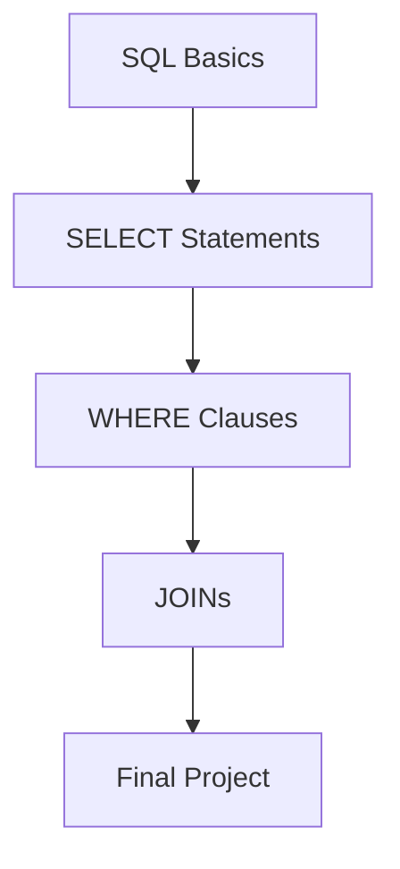

# 📂 Module: SQL Basics

This module covers the fundamentals of SQL. Explore the sub-exercises to practice your skills.

## 🌟 Features of this Course

### High-Fidelity Highlighting

All our code blocks use Shiki for professional-grade syntax highlighting:

```sql
SELECT * FROM products ORDER BY price DESC LIMIT 5;
```

### Interactive Learning

- **Run Button**: Every code block in the exercises has a "Run" button that triggers the real environment.
- **AI Mentor**: Need help? Use the AI tab to get hints based on these descriptions.

---

### Module Structure overview



> [!TIP]
> Complete each exercise in order to unlock the next one!
