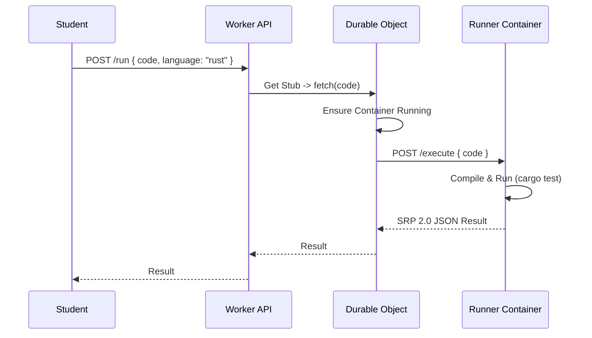

# Cloudflare Containers Proposal for Secure Runner Execution

## Introduction

As outlined in `runner_improvements.md`, a critical goal for Progy is to implement a secure, sandboxed environment for executing student code. The current "Shell Out" strategy relies on local execution, which poses significant security risks (malicious code, resource exhaustion) and limits the platform's ability to offer a robust cloud-hosted experience.

This document proposes utilizing **Cloudflare Containers** (currently in Beta) as the primary mechanism for secure, isolated code execution. This approach leverages Cloudflare's edge network to run lightweight containers alongside our existing Worker-based backend, providing a seamless and scalable solution.

## Architecture Overview

The proposed architecture integrates Cloudflare Workers, Durable Objects, and Containers to create a secure execution pipeline.

### Components

1.  **Frontend (Web UI)**:
    -   Sends the student's code and exercise metadata to the backend API.
2.  **Backend API (Cloudflare Worker)**:
    -   Receives the execution request.
    -   Validates the request and determines the appropriate runner environment (e.g., Rust, Node.js).
    -   Routes the request to a specific **Durable Object**.
3.  **Durable Object (DO)**:
    -   Acts as the controller for a specific container instance.
    -   Manages the lifecycle (start, stop, monitor) of the container.
    -   Proxies HTTP requests (code payload) to the container.
    -   Handles timeouts and resource limits.
4.  **Container (Cloudflare Container)**:
    -   A lightweight Docker container running the language-specific runner (e.g., `progy-runner-rust`).
    -   Receives code via HTTP.
    -   Executes the code in a strictly isolated environment.
    -   Returns structured output (SRP 2.0 JSON) to the DO.

### Data Flow



## Implementation Details

### 1. Docker Image Strategy

We will maintain a unified `progy-runner` Docker image or separate images per language family.

**Example `Dockerfile` (Rust):**

```dockerfile
FROM rust:1.75-slim

# Install common tools
RUN apt-get update && apt-get install -y curl build-essential

# Set up runner workspace
WORKDIR /app
COPY ./runner-server /app/server

# Expose port for Durable Object communication
EXPOSE 8080

# Start the runner server
CMD ["./server"]
```

The `runner-server` is a small HTTP server (written in Go or Rust) that accepts a POST request with code, writes it to disk, runs the test command, and streams the output back.

### 2. Wrangler Configuration

We configure the Worker to bind to the Container fleet.

**`wrangler.jsonc`:**

```jsonc
{
  "containers": [
    {
      "max_instances": 100,
      "class_name": "RunnerContainer",
      "image": "./docker/rust-runner" // Path to Dockerfile
    }
  ],
  "durable_objects": {
    "bindings": [
      {
        "name": "RUNNER_CONTAINER",
        "class_name": "RunnerContainer"
      }
    ]
  },
  "migrations": [
    {
      "tag": "v1",
      "new_sqlite_classes": ["RunnerContainer"]
    }
  ]
}
```

### 3. Worker & Durable Object Logic

**`src/worker.ts`:**

```typescript
import { WorkerEntrypoint } from "cloudflare:workers";

export class RunnerContainer extends DurableObject {
  constructor(state, env) {
    super(state, env);
    // Initialize container configuration
  }

  async fetch(request) {
    // 1. Ensure container is running (handled by DO/Container runtime)

    // 2. Forward execution request to the container's internal HTTP server
    // The container is accessible via 'localhost' or a specific internal IP mechanism provided by the runtime
    // *Note: In the current Beta, we use the `container.fetch` API provided by the binding.*

    // This logic assumes we use the `Container` class from @cloudflare/containers
    // implementation details would follow the specific Beta API.

    return await this.env.RUNNER_CONTAINER.get(this.id).fetch(request);
  }
}

export default {
  async fetch(request, env) {
    const url = new URL(request.url);
    if (url.pathname === "/execute") {
      // Route to a specific runner instance (e.g., based on user ID or a random pool)
      const id = env.RUNNER_CONTAINER.idFromName("rust-runner-pool-1");
      const stub = env.RUNNER_CONTAINER.get(id);
      return await stub.fetch(request);
    }
    return new Response("Not Found", { status: 404 });
  }
};
```

*Note: The actual implementation will use the `Container` class extension as shown in the Cloudflare docs:*

```typescript
import { Container } from "@cloudflare/workers-types"; // conceptual import

export class RustRunner extends Container {
  defaultPort = 8080;

  async execute(code: string) {
    // Custom logic to interact with the running container
    const response = await this.fetch("/run", {
      method: "POST",
      body: JSON.stringify({ code })
    });
    return response.json();
  }
}
```

## Benefits

1.  **Security & Isolation**: Containers provide a strong boundary. Unlike running code directly in a Worker (which is not allowed for arbitrary native binaries) or on the student's machine, this allows safe execution of untrusted code.
2.  **Seamless Integration**: The architecture lives entirely within the Cloudflare ecosystem, simplifying billing, deployment (via Wrangler), and observability.
3.  **Scalability**: Cloudflare manages the scheduling and scaling of containers. We don't need to manage a fleet of EC2 instances or Kubernetes clusters.
4.  **Low Latency**: Containers run on Cloudflare's edge network, potentially closer to the user than a centralized AWS region.

## Challenges & Limitations

1.  **Cold Start Times**:
    -   Containers take longer to boot than Isolates. The documentation notes "several minutes" for provisioning, though warm containers should be faster.
    -   **Mitigation**: We may need a "warm pool" of idle containers ready to accept requests to ensure instant feedback for students.
2.  **Beta Status**:
    -   The feature is in Beta. API stability and regional availability may vary.
3.  **Cost**:
    -   Running full containers is more expensive than standard Workers. We need to model the cost per exercise run (CPU/RAM duration).
4.  **State Management**:
    -   Containers are ephemeral. Any persistence (e.g., student files across multiple runs) must be handled by external storage (R2/D1) and synced into the container on startup.

## Conclusion

Adopting Cloudflare Containers aligns perfectly with Progy's "Serverless / Edge First" philosophy. It solves the critical security gap of remote code execution without introducing a separate cloud provider (like AWS Fargate or Fly.io).

**Recommendation**:
Proceed with a **Proof of Concept (PoC)** implementing a single `Rust` runner using this architecture. Measure cold start times and execution latency to validate viability for an interactive educational platform.
