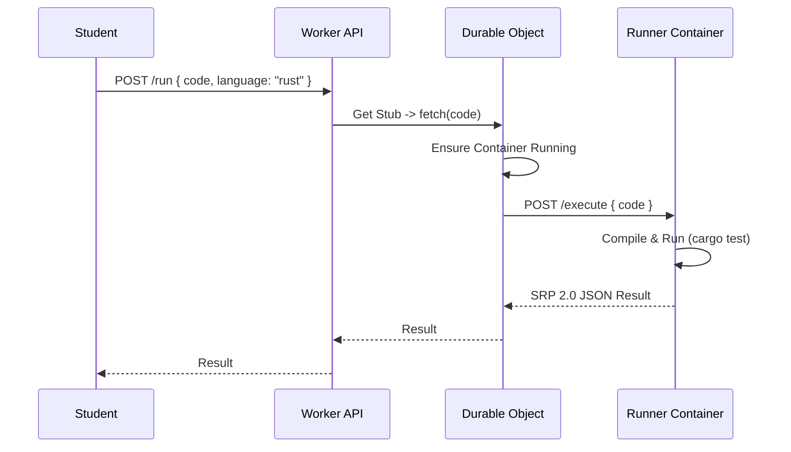

# Cloudflare Containers Proposal for Secure Runner Execution

## Introduction

As outlined in `runner_improvements.md`, a critical goal for Progy is to implement a secure, sandboxed environment for executing student code. The current "Shell Out" strategy relies on local execution, which poses significant security risks (malicious code, resource exhaustion) and limits the platform's ability to offer a robust cloud-hosted experience.

This document proposes utilizing **Cloudflare Containers** (currently in Beta) as the primary mechanism for secure, isolated code execution. This approach leverages Cloudflare's edge network to run lightweight containers alongside our existing Worker-based backend, providing a seamless and scalable solution.

## Architecture Overview

The proposed architecture integrates Cloudflare Workers, Durable Objects, and Containers to create a secure execution pipeline.

### Components

1.  **Frontend (Web UI)**:
    -   Sends the student's code and exercise metadata to the backend API.
2.  **Backend API (Cloudflare Worker)**:
    -   Receives the execution request.
    -   Validates the request and determines the appropriate runner environment (e.g., Rust, Node.js).
    -   Routes the request to a specific **Durable Object**.
3.  **Durable Object (DO)**:
    -   Acts as the controller for a specific container instance.
    -   Manages the lifecycle (start, stop, monitor) of the container.
    -   Proxies HTTP requests (code payload) to the container.
    -   Handles timeouts and resource limits.
4.  **Container (Cloudflare Container)**:
    -   A lightweight Docker container running the language-specific runner (e.g., `progy-runner-rust`).
    -   Receives code via HTTP.
    -   Executes the code in a strictly isolated environment.
    -   Returns structured output (SRP 2.0 JSON) to the DO.

### Data Flow



## Detailed Implementation Plan

This section outlines the specific file changes required to implement this architecture in `apps/backend` (Cloudflare Worker) and `apps/progy` (CLI/Local Server).

### 1. `apps/backend` (Cloudflare Worker)

The backend needs to be updated to support the Container binding and the Durable Object that manages it.

#### A. Update `wrangler.jsonc`
Add the `containers` and `durable_objects` configurations to bind the worker to the container fleet.

```jsonc
// apps/backend/wrangler.jsonc
{
  // ... existing config
  "containers": [
    {
      "max_instances": 10,
      "class_name": "RunnerContainer",
      "image": "./docker/rust-runner" // Path to directory containing Dockerfile
    }
  ],
  "durable_objects": {
    "bindings": [
      {
        "name": "RUNNER_CONTAINER",
        "class_name": "RunnerContainer"
      }
    ]
  },
  "migrations": [
    // ... existing migrations
    {
      "tag": "v2", // Increment tag
      "new_sqlite_classes": ["RunnerContainer"]
    }
  ]
}
```

#### B. Create `src/runner/container.ts`
This file defines the Durable Object that controls the container. We use the `Container` helper class from the Cloudflare Containers SDK to simplify interactions.

```typescript
// apps/backend/src/runner/container.ts
import { Container } from "@cloudflare/workers-types/experimental"; // Or specific package

export class RunnerContainer extends Container {
  // Configuration
  defaultPort = 8080;
  sleepAfter = '30s'; // Shut down container after 30s of inactivity to save costs

  constructor(state: DurableObjectState, env: CloudflareBindings) {
    super(state, env);
  }

  // The Container class automatically handles onStart/onStop/fetch logic
  // We can override methods or add custom RPC methods.

  // Custom RPC method to execute code
  async execute(code: string, language: string) {
    // The `this.fetch` method on the Container class proxies the request
    // to the running container instance on `localhost:defaultPort`.
    const response = await this.fetch("/execute", {
      method: "POST",
      headers: { "Content-Type": "application/json" },
      body: JSON.stringify({ code, language })
    });

    if (!response.ok) {
      throw new Error(`Runner failed: ${await response.text()}`);
    }

    return await response.json();
  }
}
```

#### C. Update `src/index.ts`
Register the new Durable Object and add a route to handle runner requests.

```typescript
// apps/backend/src/index.ts
import { RunnerContainer } from './runner/container';

// ... existing imports

// Register the DO class export so Cloudflare can find it
export { RunnerContainer };

const app = new Hono<{ Bindings: CloudflareBindings }>();

// ... existing middleware

app.post('/runner/execute', async (c) => {
  const { code, language } = await c.req.json();

  // Logic to select a container ID. For now, random or hashed by user ID to reuse warm containers.
  // Using a stable ID allows reusing the same container instance (warm start).
  const id = c.env.RUNNER_CONTAINER.idFromName("shared-runner-pool-1");
  const stub = c.env.RUNNER_CONTAINER.get(id);

  // Invoke the RPC method on the DO
  return c.json(await stub.execute(code, language));
});

// ... existing routes
```

### 2. `apps/progy` (CLI / Local Server)

The local server needs to be able to offload execution to the cloud when configured.

#### A. Update `src/backend/endpoints/exercises.ts`
Modify the `runHandler` to support a remote execution mode.

```typescript
// apps/progy/src/backend/endpoints/exercises.ts

// ... imports
import { BACKEND_URL } from "../helpers";

const runHandler: ServerType<"/exercises/run"> = async (req) => {
  try {
    await ensureConfig();
    const body = await req.json();

    // Check for remote execution flag in config or env
    const useRemoteRunner = process.env.PROGY_USE_REMOTE === "true" || currentConfig.runner.type === "remote";

    if (useRemoteRunner) {
        // 1. Gather all necessary files (not just the main file, but the full context)
        // For simplicity, we might zip the directory or just send the main file content for now.
        const code = await getExerciseCode(body.id); // Helper to get code content

        // 2. Call the Cloud Backend
        const token = await loadToken(); // Helper from config.ts
        const res = await fetch(`${BACKEND_URL}/runner/execute`, {
            method: "POST",
            headers: {
                "Authorization": `Bearer ${token}`,
                "Content-Type": "application/json"
            },
            body: JSON.stringify({
                code,
                language: currentConfig.runner.language,
                exerciseId: body.id
            })
        });

        const result = await res.json();
        // 3. Normalize result to SRP format if needed
        return Response.json(result);
    }

    // ... existing local spawn logic ...
```

## Docker Image Strategy

We will maintain a unified `progy-runner` Docker image or separate images per language family.

**Example `Dockerfile` (Rust):**

```dockerfile
FROM rust:1.75-slim

# Install common tools
RUN apt-get update && apt-get install -y curl build-essential

# Set up runner workspace
WORKDIR /app
COPY ./runner-server /app/server

# Expose port for Durable Object communication
EXPOSE 8080

# Start the runner server
CMD ["./server"]
```

The `runner-server` is a small HTTP server (written in Go or Rust) that accepts a POST request with code, writes it to disk, runs the test command, and streams the output back.

## Benefits

1.  **Security & Isolation**: Containers provide a strong boundary. Unlike running code directly in a Worker (which is not allowed for arbitrary native binaries) or on the student's machine, this allows safe execution of untrusted code.
2.  **Seamless Integration**: The architecture lives entirely within the Cloudflare ecosystem, simplifying billing, deployment (via Wrangler), and observability.
3.  **Scalability**: Cloudflare manages the scheduling and scaling of containers. We don't need to manage a fleet of EC2 instances or Kubernetes clusters.
4.  **Low Latency**: Containers run on Cloudflare's edge network, potentially closer to the user than a centralized AWS region.

## Challenges & Limitations

1.  **Cold Start Times**:
    -   Containers take longer to boot than Isolates. The documentation notes "several minutes" for provisioning, though warm containers should be faster.
    -   **Mitigation**: We may need a "warm pool" of idle containers ready to accept requests to ensure instant feedback for students.
2.  **Beta Status**:
    -   The feature is in Beta. API stability and regional availability may vary.
3.  **Cost**:
    -   Running full containers is more expensive than standard Workers. We need to model the cost per exercise run (CPU/RAM duration).
4.  **State Management**:
    -   Containers are ephemeral. Any persistence (e.g., student files across multiple runs) must be handled by external storage (R2/D1) and synced into the container on startup.

## Conclusion

Adopting Cloudflare Containers aligns perfectly with Progy's "Serverless / Edge First" philosophy. It solves the critical security gap of remote code execution without introducing a separate cloud provider (like AWS Fargate or Fly.io).

**Recommendation**:
Proceed with a **Proof of Concept (PoC)** implementing a single `Rust` runner using this architecture. Measure cold start times and execution latency to validate viability for an interactive educational platform.
