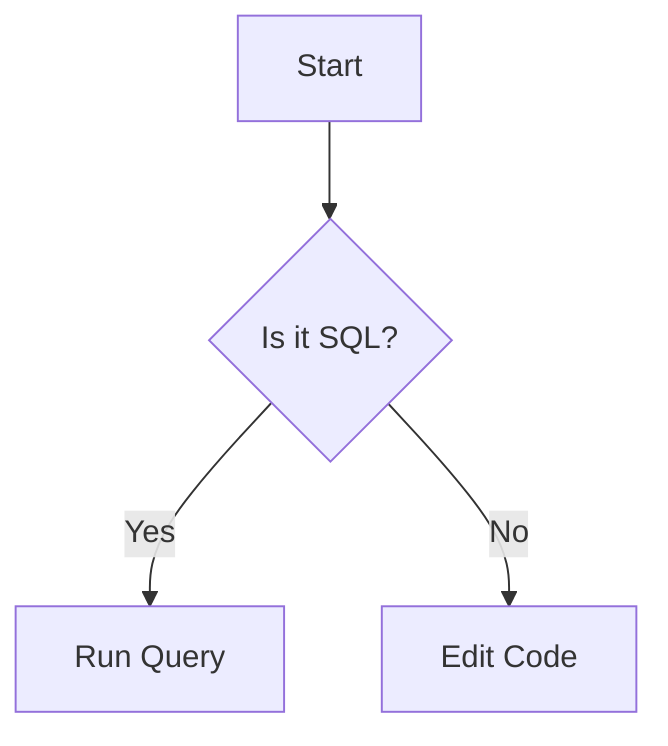

# Progy Instructor Guide

Welcome to the Progy Instructor Guide. This document is the definitive reference for creating, structuring, and distributing interactive coding courses on the Progy platform. Whether you are building a simple "Hello World" tutorial or a complex microservices architecture course, this guide will walk you through every concept.

---

## 1. Introduction

A Progy Course is more than just a collection of Markdown files. It is an interactive learning environment that combines:

- **Structured Content**: Lessons and modules organized logically.
- **Live Code Execution**: Students run code directly in their environment.
- **Smart Feedback**: Automated tests and diagnostics (Smart Runner Protocol).
- **Rich Media**: Quizzes, diagrams, and explanations.

Progy courses are designed to be **git-native**. Students clone a repository, and the Progy CLI layers interactive content on top of their workspace.

---

## 2. Project Structure

A standard Progy course follows a strict directory structure to ensure the CLI can parse and run it correctly.

```text
my-awesome-course/
├── course.json          # Main configuration file (The "Manifest")
├── progy.toml           # Workspace configuration (Student's state)
├── Dockerfile           # (Optional) For custom environments
├── runner.py            # (Optional) Wrapper script for SRP
├── content/             # (Optional) Static content like images
└── content/           # The core learning material
    ├── 01_intro/        # Module 1
    │   ├── 01_hello/    # Exercise 1
    │   │   ├── main.py  # Starter code
    │   │   ├── README.md# Instructions
    │   │   └── quiz.json# (Optional) Quiz
    │   └── info.toml    # Module metadata
    └── 02_advanced/     # Module 2
        └── ...
```

### Key Files

- **`course.json`**: Defines the runner type, command to execute code, and course metadata.
- **`content/`**: Contains the actual lessons. The folder structure dictates the menu in the UI.
- **`README.md` (inside exercise)**: The lesson text displayed to the student. Supports standard Markdown.
- **`main.*` (inside exercise)**: The entry point file the student will edit.

---

## 3. Course Configuration (`course.json`)

This is the heart of your course. It tells Progy how to run the student's code.

### Schema

```json
{
  "id": "python-mastery",
  "name": "Python Mastery: From Zero to Hero",
  "description": "A comprehensive guide to modern Python.",
  "runner": {
    "type": "process",
    "command": "python3 {{exercise}}"
  },
  "content": {
    "exercises": "exercises"
  }
}
```

### Runner Types

The `runner.type` field determines _where_ and _how_ the code executes.

1.  **`process` (Default)**: Runs directly on the student's host machine.
    - **Pros**: Zero setup, fast.
    - **Cons**: Requires student to have languages installed (e.g., Python, Rust). insecure (runs on host).
    - **Best For**: Simple syntax tutorials, CLI tools.

2.  **`docker-local`**: Runs inside a Docker container on the student's machine.
    - **Pros**: reproducible environment, isolated, supports complex dependencies.
    - **Cons**: Requires Docker Desktop.
    - **Best For**: Web servers, databases, specific compiler versions.

3.  **`docker-compose`**: Runs a multi-container stack.
    - **Pros**: Full integration testing (App + DB + Cache).
    - **Best For**: Full-stack engineering courses.

---

## 4. The Smart Runner Protocol (SRP)

The **Smart Runner Protocol (SRP)** is how the executed code communicates back to the Progy UI. It allows you to show rich results like "✅ 5/5 Tests Passed" instead of just raw text output.

### The Format

The runner (or your code) must print a JSON block wrapped in special markers to `stdout`:

```text
__SRP_BEGIN__
{
  "success": true,
  "summary": "All tests passed!",
  "diagnostics": [],
  "tests": [
    { "name": "Function add(2,2)", "status": "pass" },
    { "name": "Function sub(5,3)", "status": "pass" }
  ],
  "raw": "Output: 4\nOutput: 2"
}
__SRP_END__
```

### Fields

| Field         | Type   | Description                                                                                                                                    |
| ------------- | ------ | ---------------------------------------------------------------------------------------------------------------------------------------------- |
| `success`     | bool   | **Required.** Did the exercise pass? Controls the green/red status in the UI.                                                                  |
| `summary`     | string | **Required.** A short message displayed prominently (e.g., "All tests passed!", "Query returned 3 rows").                                      |
| `raw`         | string | **Required.** The actual output to show in both "Raw" and "Friendly" views. This is where query results, program output, or error messages go. |
| `tests`       | array  | Optional. List of individual test cases with `name`, `status` ("pass"/"fail"), and optional `message`.                                         |
| `diagnostics` | array  | Optional. Compiler errors or linter warnings with `severity`, `message`, `file`, `line`, and `snippet`.                                        |

### Output Display in UI

The Progy UI displays SRP output in two views:

1. **Friendly View**: Shows:
   - `✅ Success` or `❌ Failed` header
   - The `summary` as a quote block
   - Any `diagnostics` formatted with file/line info
   - Any `tests` with pass/fail icons
   - The `raw` content in a code block under "📋 Output"

2. **Raw View**: Shows only the `raw` field as plain text.

### Best Practices for Good Output

#### 1. Make `summary` Meaningful

```python
# ❌ Bad - Too generic
summary = "Success"

# ✅ Good - Tells student what happened
summary = "Correct! You selected all 3 users."
summary = "Query returned 5 rows (expected 3)"
summary = "Function returned 42 (expected 100)"
```

#### 2. Include Useful Data in `raw`

The `raw` field appears in both views. For data-driven exercises (SQL, API calls), show the actual results:

```python
# SQL Example
raw = f"Columns: {column_names}\n"
for row in rows:
    raw += str(row) + "\n"

# API Example
raw = f"Status: {status_code}\nBody: {json.dumps(response, indent=2)}"

# Computation Example
raw = f"Input: {input_value}\nOutput: {result}\nExpected: {expected}"
```

#### 3. Format Errors Helpfully

When the student's code fails, give them actionable feedback:

```python
# ❌ Bad
raw = str(exception)

# ✅ Good
raw = f"""Error Type: {type(e).__name__}
Message: {str(e)}

Your code:
  {student_code_line}
        ^-- Error occurred here

Hint: Check if the table name is correct.
"""
```

#### 4. Use `tests` for Multi-Step Validation

When you have multiple assertions, use the `tests` array:

```python
response = {
    "success": all_passed,
    "summary": f"{passed_count}/{total_count} tests passed",
    "tests": [
        {"name": "Returns correct type", "status": "pass"},
        {"name": "Handles empty input", "status": "fail", "message": "Expected [] but got None"},
        {"name": "Handles negative numbers", "status": "pass"}
    ],
    "raw": full_output
}
```

#### 5. Use `diagnostics` for Code Issues

For compiler/linter errors with specific locations:

```python
response = {
    "success": False,
    "summary": "Syntax Error",
    "diagnostics": [
        {
            "severity": "error",
            "message": "expected `;` after expression",
            "file": "main.rs",
            "line": 15,
            "snippet": "let x = 5"
        }
    ],
    "raw": full_compiler_output
}
```

### Complete SQL Runner Example

Here's a well-structured runner that produces excellent output:

```python
import sys, os, json, psycopg2

def main():
    file_path = f"/workspace/{sys.argv[1]}"

    try:
        with open(file_path) as f:
            sql = f.read().strip()

        conn = psycopg2.connect(...)
        cur = conn.cursor()
        cur.execute(sql)

        if cur.description:
            columns = [d[0] for d in cur.description]
            rows = cur.fetchall()

            # Build a nice table for raw output
            raw = f"Columns: {columns}\n"
            raw += "-" * 40 + "\n"
            for row in rows:
                raw += " | ".join(str(v) for v in row) + "\n"

            summary = f"Query returned {len(rows)} row(s)"
            success = True
        else:
            raw = "Query executed (no results returned)"
            summary = "Statement executed successfully"
            success = True

    except psycopg2.Error as e:
        success = False
        summary = "SQL Error"
        raw = f"Error Code: {e.pgcode}\nMessage: {e.pgerror}"
    except Exception as e:
        success = False
        summary = "Runner Error"
        raw = str(e)

    print("__SRP_BEGIN__")
    print(json.dumps({"success": success, "summary": summary, "raw": raw}))
    print("__SRP_END__")

if __name__ == "__main__":
    main()
```

---

## 5. Implementing a Custom Runner (The Wrapper Pattern)

**Crucial Concept**: You typically do **not** want students to write `print("__SRP_BEGIN__")` in their code. It's ugly and confusing.

Instead, you use the **Wrapper Pattern**. You create a script (e.g., `runner.py`, `runner.js`) that runs the student's code, captures the output, and prints the SRP JSON.

### Step-by-Step Guide: Docker Local Runner

Let's create a robust Python course using `docker-local`.

#### 1. Configuration (`course.json`)

Point the command to your _wrapper script_, passing the student's file as an argument.

```json
{
  "runner": {
    "type": "docker-local",
    "dockerfile": "Dockerfile",
    "command": "python3 /workspace/runner.py {{exercise}}"
  }
}
```

_Note_: `{{exercise}}` is a placeholder Progy replaces with the path to the student's file (e.g., `exercises/01_hello/main.py`).

#### 2. The `Dockerfile`

Install Python and copy your wrapper script into the image.

```dockerfile
FROM python:3.9-slim

# Set workdir
WORKDIR /workspace

# Copy the wrapper script (which you will create in the root of your repo)
COPY runner.py /workspace/runner.py

# Default command (fallback)
CMD ["python3", "/workspace/runner.py"]
```

#### 3. The Wrapper Script (`runner.py`)

This script does the heavy lifting: executes code -> catches errors -> formats JSON.

```python
import sys
import subprocess
import json

def main():
    # 1. Get the file path from arguments
    if len(sys.argv) < 2:
        print("Error: No file provided.")
        sys.exit(1)

    file_path = sys.argv[1]

    # 2. Run the student's code
    try:
        result = subprocess.run(
            ["python3", file_path],
            capture_output=True, # Capture stdout/stderr
            text=True,
            timeout=5 # Prevent infinite loops
        )

        success = result.returncode == 0
        output = result.stdout + result.stderr

        # 3. Construct SRP JSON
        response = {
            "success": success,
            "summary": "Execution Successful" if success else "Runtime Error",
            "raw": output
        }

    except subprocess.TimeoutExpired:
        response = {
            "success": False,
            "summary": "Timeout: Code took too long to run.",
            "raw": ""
        }

    # 4. Print the Protocol
    print("__SRP_BEGIN__")
    print(json.dumps(response))
    print("__SRP_END__")

if __name__ == "__main__":
    main()
```

#### 4. The Student Experience

The student opens `exercises/01_hello/main.py`.
They see:

```python
print("Hello World")
```

They click "Run".
They see:
**✅ Execution Successful**

```text
Hello World
```

They never see `runner.py` or `__SRP_BEGIN__`. This is the ideal experience.

---

## 6. Advanced: Multi-Container Environments (`docker-compose`)

For full-stack courses (e.g., "Node.js with Redis"), a single container isn't enough. Use `docker-compose`.

### Configuration

```json
{
  "runner": {
    "type": "docker-compose",
    "compose_file": "docker-compose.yml",
    "service_to_run": "app_test"
  }
}
```

- `service_to_run`: The specific service name in compose that runs the tests.

### `docker-compose.yml`

```yaml
version: '3.8'
services:
  redis:
    image: redis:alpine

  app_test:
    build: .
    volumes:
      - .:/workspace # Mount code
    depends_on:
      - redis
    environment:
      REDIS_URL: redis://redis:6379
    command: npm test
```

When the student runs code:

1.  Progy runs `docker compose up redis` (implicitly via `run`).
2.  Progy runs `docker compose run --rm app_test`.
3.  The `app_test` container executes `npm test`.
4.  Progy cleans up with `docker compose down`.

---

## 7. Content Creation Details

### Metadata (`info.toml`)

Place an `info.toml` file in each module folder (e.g., `exercises/01_intro/info.toml`) to order exercises and define titles.

```toml
[module]
title = "Introduction to Python"
message = "Let's start your journey!"

[exercises]
# Order matters!
01_hello = "Hello World"
02_variables = { title = "Variables & Types", xp = 50 }
```

### Quizzes (`quiz.json`)

Place `quiz.json` inside an exercise folder to add a multiple-choice quiz tab.

```json
[
  {
    "question": "Which keyword defines a function in Python?",
    "options": ["func", "def", "function", "define"],
    "answer": 1,
    "explanation": "Python uses 'def' to define functions."
  }
]
```

_Note_: `answer` is the zero-based index of the correct option.

### Markdown Features (`README.md`)

Progy uses a high-fidelity Markdown renderer with premium features to create an immersive learning experience. Beyond standard Markdown, you have access to:

#### 1. Premium Callouts

Support for Obsidian-style callouts to highlight important information.

> [!INFO]
> This is an informative callout.

> [!WARNING]
> This is a warning callout.

**Alternative Syntax (Directives):**

```markdown
::note{title="Pro-Tip"}
You can also use directives for cleaner structured notes.
::
```

#### 2. Diagrams as Code (Mermaid)

Render complex diagrams directly from text.



#### 3. Mathematical Expressions (LaTeX)

Perfect for AI, Data Science, or Algorithms courses.

- **Inline**: Use `$e = mc^2$` for $e = mc^2$.
- **Block**:
  $$
  \int_{a}^{b} x^2 \,dx = \frac{b^3 - a^3}{3}
  $$

#### 4. Interactive Code Blocks

All code blocks (` ``` `) in Progy are enhanced with:

- **Copy to Clipboard**: One-click copy for students.
- **Run in Workspace**: A "Run" button appears on code blocks, which automatically triggers the exercise's test runner, providing immediate feedback loop.

#### 5. Video Embeds

Easily integrate video lessons.

```markdown
::video{src="https://example.com/video.mp4"}
```

#### 6. GitHub Flavored Markdown (GFM)

Full support for advanced structures:

- **Tables**: Organise data effectively.
- **Task Lists**: Checkable lists for student progress.
- **Auto-links**: Automatic link detection for URLs.

---

## 8. CLI Tooling for Instructors

The Progy CLI is your primary tool for creating and testing courses.

### `progy create <name>`

Creates a new course boilerplate from a template.

```bash
bunx progy validate [path]
```

### `progy dev`

Starts the course runner in **Development Mode**.

**Features:**

- **Live Reload**: Changes to `README.md` or code files are reflected immediately on the next request.
- **Source Mode**: Runs directly from your file system (ignores `.progy` archives).
- **No Authentication**: Can be run with `--offline` for air-gapped development.

**Usage:**

```bash
cd my-course
bunx progy dev
# or
bunx progy dev --offline
```

### `progy pack`

Packages your course into a `.progy` archive for distribution.

**Why use this?**

- To verify the exact artifact students will download.
- To share your course manually (e.g., via USB or private network).

**Usage:**

```bash
bunx progy pack --out my-course-v1.progy
```

## Tips for Instructors

- **Metadata**: Update `course.json` with a clear `name` and `runner` configuration.
- **Hidden Files**: The packer automatically ignores `node_modules`, `.git`, `.next`, and `target` directories to keep the archive small.
- **Testing**: Always run `progy dev` and solve `01_intro` yourself to ensure the runner configuration (`Cargo.toml`, `go.mod`, etc.) is correct.
