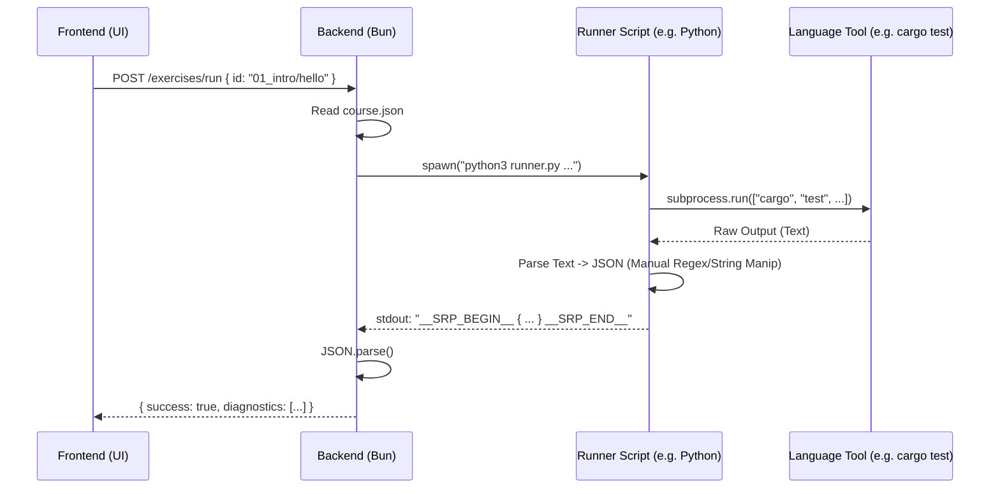
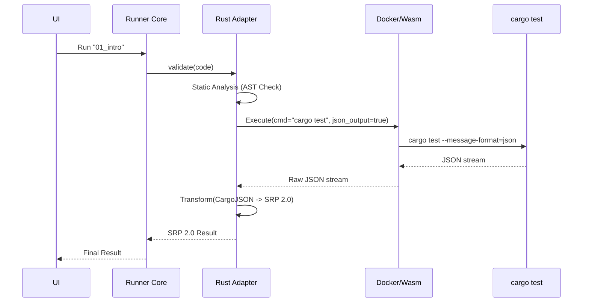

# Progy Runner Architecture: Comprehensive Improvement Proposal

This document outlines a detailed proposal for overhauling the exercise execution ("Runner") system within Progy. The goal is to move from a simple shell-execution model to a robust, secure, and developer-friendly **Smart Runner Protocol (SRP 2.0)**.

---

## Table of Contents

1. [Current Architecture Analysis](#current-architecture-analysis)
2. [Pain Points & Limitations](#pain-points--limitations)
3. [Proposed Architecture: The "Smart Runner"](#proposed-architecture-the-smart-runner)
4. [The Progy Runner Protocol (SRP 2.0)](#the-progy-runner-protocol-srp-20)
5. [Sandboxing & Security](#sandboxing--security)
6. [Built-in Adapters vs. Custom Runners](#built-in-adapters-vs-custom-runners)
7. [Static Analysis & Linting Integration](#static-analysis--linting-integration)
8. [AI-Enhanced Feedback Loop](#ai-enhanced-feedback-loop)
9. [Implementation Roadmap](#implementation-roadmap)
10. [Competitive Analysis](#competitive-analysis)
11. [Detailed JSON Schema Examples](#detailed-json-schema-examples)
12. [Security Threat Model](#security-threat-model)
13. [Telemetry & Analytics](#telemetry--analytics)
14. [Migration Strategy](#migration-strategy)

---

## Current Architecture Analysis

Currently, Progy uses a "Shell Out" strategy for running exercises. The flow is as follows:

1.  **Configuration:** `course.json` defines a `runner` object with a `command` string (e.g., `python3 scripts/test_runner.py {{exercise}}`).
2.  **Execution:** The backend (`apps/progy/src/backend/endpoints/exercises.ts`) spawns this command as a child process.
3.  **Communication:** The runner writes to `stdout` / `stderr`.
4.  **Parsing:** The backend (`apps/progy/src/backend/helpers.ts`) attempts to parse the output using regex, looking for a JSON block wrapped in `__SRP_BEGIN__` and `__SRP_END__`.
5.  **Fallback:** If no JSON is found, the raw text output is displayed to the user, and success is determined by the process exit code (0 = success).

### Current Data Flow



---

## Pain Points & Limitations

### 1. High Burden on Instructors
Instructors must act as "Tooling Engineers." To create a Rust course, they don't just write Rust exercises; they must write a Python/JS/Shell script that:
*   Invokes `cargo test`.
*   Captures `stdout` and `stderr`.
*   **Parses** the specific output format of `cargo test` (which can change between versions).
*   Constructs a specific JSON object matching Progy's internal `SRPOutput` interface.
*   Handles edge cases (compilation errors vs. runtime errors vs. test failures).

### 2. Fragility
If the underlying language tool updates its output format (e.g., Rust changes how it prints compiler errors), the custom runner script breaks. The instructor has to update their course repo to fix it.

### 3. Security Risks
The current `spawn` model runs code directly on the user's machine (or the server hosting the backend).
*   **Malicious Code:** A student (or a malicious course creator) could write code that deletes files (`rm -rf ~`), steals SSH keys, or installs malware.
*   **Resource Exhaustion:** A `while(true)` loop in an exercise can freeze the host machine.

### 4. Poor User Experience (Fallback Mode)
When the runner script fails to output valid JSON (which happens often during development), Progy falls back to showing raw `stdout`.
*   This raw output often contains noisy build logs.
*   It lacks structured data for "Syntax Highlighting" of errors.
*   It doesn't integrate with the UI's "Hints" or "Progress" systems efficiently.

### 5. Lack of Rich Features
*   **No Code Coverage:** We can't easily tell the user "You covered 80% of the solution."
*   **No AST Analysis:** We can't enforce constraints like "You must use a `for` loop" or "Do not use `unwrap()`."
*   **Single File Focus:** The current model assumes single-file exercises. Complex, multi-file projects are hard to validate.

---

## Proposed Architecture: The "Smart Runner"

We propose moving to a **Plug-in Adapter Architecture**. Instead of raw commands, `course.json` will specify a **Runner Type** (e.g., `rust`, `python`, `go`, `generic`).

Progy will ship with **Official Runners** that handle the complexity of invoking tools and parsing output.

### Key Components

1.  **Runner Core:** A centralized service in the backend that manages the lifecycle of exercise execution.
2.  **Adapters:** Language-specific modules (TypeScript classes) that implement a standard `IRunner` interface.
3.  **Sandboxed Executor:** A layer that wraps the execution in a container (Docker) or a restricted environment (nsjail/Wasm).
4.  **SRP 2.0:** A strict, schema-validated JSON protocol for communication.

### New Data Flow



---

## The Progy Runner Protocol (SRP 2.0)

We need to formalize the `SRPOutput` into a robust protocol. It should support streaming updates (e.g., "Compiling..." -> "Running Test 1..." -> "Done").

### JSON Schema Specification

```typescript
// srp-v2.ts

export type Severity = 'error' | 'warning' | 'info' | 'hint';

export interface SourceLocation {
  file: string;
  startLine: number;
  startColumn?: number;
  endLine?: number;
  endColumn?: number;
}

export interface Diagnostic {
  code?: string; // e.g., "E0308" (Rust error code)
  severity: Severity;
  message: string;
  location?: SourceLocation;
  context?: {
    codeSnippet: string; // The specific line of code
    highlights?: Array<{ start: number, end: number, label?: string }>;
  };
  fix?: {
    description: string; // e.g., "Add a semicolon"
    replacement: string;
    range: SourceLocation;
  };
  docsUrl?: string; // Link to official docs for this error
}

export interface TestResult {
  name: string; // e.g., "test_addition"
  status: 'pass' | 'fail' | 'skip' | 'timeout';
  durationMs: number;
  error?: {
    message: string;
    stack?: string;
    diff?: { // Useful for assertion errors
      expected: string;
      actual: string;
    };
  };
}

export interface RunnerResult {
  version: "2.0";
  status: 'success' | 'failure' | 'error'; // 'error' means the runner itself crashed
  exitCode: number;
  durationMs: number;

  // High-level feedback
  summary: string; // "3/5 Tests Passed"

  // Detailed data
  diagnostics: Diagnostic[];
  tests: TestResult[];

  // Stdout/Stderr captured (if raw output is needed for debugging)
  logs: Array<{ stream: 'stdout' | 'stderr', content: string, timestamp: number }>;

  // Custom metrics (optional)
  metrics?: {
    memoryUsage?: number;
    coverage?: number;
  };
}
```

### Protocol Features

1.  **Structured Diff:** For test failures, explicit `expected` vs `actual` fields allow the UI to render a rich diff view (green/red background).
2.  **Auto-Fix Suggestions:** Many compilers (Rust, TS) provide "quick fixes." We should pass these through so the UI can offer a "Fix it" button.
3.  **Documentation Links:** Linking directly to `doc.rust-lang.org` for specific error codes helps learning.

---

## Sandboxing & Security

This is the most critical infrastructure upgrade. We cannot rely on the user's host environment forever, especially for a "Pro" or "Cloud" version.

### Option 1: Docker (The Standard)
*   **Pros:** Full isolation, standard tooling, supports all languages.
*   **Cons:** Heavy, requires Docker daemon, slow startup (unless pre-warmed).
*   **Strategy:** Maintain a `progy-runner` image with common languages installed (Rust, Go, Node, Python). Mount the exercise volume read-only (except specifically allowed output dirs).

### Option 2: WebAssembly / WASI (The Future)
*   **Pros:** Extremely fast (ms startup), secure by default, portable.
*   **Cons:** Not all languages compile easily to WASI yet (e.g., Python requires a WASM build of CPython). System calls are limited (file I/O needs mapping).
*   **Strategy:** Use **Wasmtime** or **Wasmer** to run compiled binaries. For interpreted languages like Python/JS, use WASM-compiled runtimes.

### Option 3: `nsjail` (Linux Only / Cloud)
*   **Pros:** Lightweight process isolation (namespaces, cgroups). Used by competitive programming sites.
*   **Cons:** Linux only. Hard to set up on macOS/Windows dev machines.

### Recommendation
For the **Local CLI**, we should default to **Host Execution (Standard)** but add a `--sandbox=docker` flag for users who want isolation.
For the **Cloud Platform**, we must use **gVisor** (Google's container runtime) or **Firecracker MicroVMs** for strict isolation.

---

## Built-in Adapters vs. Custom Runners

Progy should include "Smart Adapters" for the top 10 languages.

### The Adapter Interface

```typescript
export interface RunnerAdapter {
  id: string; // e.g., "rust-cargo"
  name: string;

  /**
   * Detects if this adapter is suitable for the given directory
   */
  detect(files: string[]): boolean;

  /**
   * Generates the command to run
   */
  getCommand(context: RunnerContext): Promise<Command>;

  /**
   * Parses the raw output into SRP 2.0
   */
  parseOutput(output: string, exitCode: number): Promise<RunnerResult>;
}
```

### Example: `RustCargoAdapter` logic

Instead of regex parsing text, it would run:
`cargo test --message-format=json`

This outputs a stream of JSON objects from `rustc`. The adapter would:
1.  Read the JSON stream.
2.  Filter for `"message-type": "diagnostic"`.
3.  Map Rust's `spans` to SRP `SourceLocation`.
4.  Map Rust's `rendered` message to SRP `message`.
5.  Aggregate test results.

This is **robust**. If Rust updates its text output, the JSON schema usually remains backward compatible.

---

## Static Analysis & Linting Integration

A "Runner" shouldn't just run tests. It should teach best practices.

### Proposal: Pre-run Checks

Before executing the user's code, the Runner can run a lightweight static analysis phase.

1.  **Linter Integration:**
    *   JS/TS: Run `eslint` or `biome` automatically.
    *   Rust: Run `clippy`.
    *   Go: Run `golangci-lint`.

    If the linter fails with "critical" errors, we can fail the run early with helpful feedback: *"Your code is correct, but you're using a deprecated function. Try X instead."*

2.  **Structural Requirements (AST):**
    Instructors often want to ensure a specific concept is used.
    *   *Exercise:* "Implement factorial using recursion."
    *   *Check:* Parse the AST. Does the function call itself? If not, fail with: *"You used a loop, but the exercise requires recursion."*

    **Implementation:**
    *   Use `tree-sitter` (fast, multi-language parser) to query the code structure.
    *   Allow `course.json` to define "AST assertions" like:
        ```json
        "assertions": [
          { "type": "contains_call", "name": "factorial" },
          { "type": "no_keyword", "name": "for" }
        ]
        ```

---

## AI-Enhanced Feedback Loop

With the SRP 2.0 protocol, we have structured error data (error code, message, file, snippet). We can feed this into an LLM (OpenAI/Anthropic) to generate **Context-Aware Hints**.

### Workflow
1.  Runner fails.
2.  Adapter produces SRP JSON: `{ code: "E0382", message: "borrow of moved value: x" }`.
3.  Progy Backend detects "Failure".
4.  (Optional) User clicks "Explain this Error".
5.  Backend sends prompt to LLM:
    > "The user is learning Rust. They encountered error E0382 on line 12. Here is the code snippet. Explain 'ownership' simply in the context of this error."

6.  LLM response is rendered in the "Assistant" panel.

This is far superior to sending just raw text output to the LLM, as the structured data reduces hallucination (we know *exactly* what the error code is).

---

## Implementation Roadmap

This is a significant refactor. It should be done in phases.

### Phase 1: Protocol Definition & Types (Week 1)
*   Create `packages/srp` (shared library).
*   Define `SRPOutput` (v2) interfaces in Zod (for runtime validation) and TypeScript.
*   Write a comprehensive test suite of "Golden Files" (example outputs for Rust, Go, JS failures) to validate the schema covers all cases.

### Phase 2: Refactor `apps/prog` Backend (Week 2)
*   Create `RunnerService` class.
*   Implement the `Adapter` pattern.
*   Create `GenericAdapter` (legacy support) that behaves like the current system (spawns command, regex parse).
*   Switch the main execution endpoint to use `RunnerService`.

### Phase 3: Implement `RustAdapter` and `TypeScriptAdapter` (Week 3)
*   **Rust:** Implement `cargo test --message-format=json` parsing.
*   **TS:** Implement a custom `Bun test` or `Vitest` reporter that outputs SRP JSON directly.
*   Verify that existing courses still work (fallback to GenericAdapter if specific one fails).

### Phase 4: UI Updates (Week 4)
*   Update the Frontend `Terminal` component to render SRP v2.
*   Create `DiagnosticCard` components (pretty error boxes).
*   Add `TestResultList` component (green/red ticks with duration).

### Phase 5: Advanced Features (Future)
*   Add `tree-sitter` integration for AST checks.
*   Implement `Docker` sandbox strategy for the CLI (`progy run --sandbox`).

---

## Example: Rust Adapter Implementation Plan

Here is a pseudo-code draft of how the Rust Adapter would look:

```typescript
import { RunnerAdapter, RunnerResult } from "@progy/srp";

export class RustAdapter implements RunnerAdapter {
  id = "rust";

  async run(context: Context): Promise<RunnerResult> {
    // 1. Run Cargo with JSON output
    const proc = spawn("cargo", ["test", "--message-format=json"], { cwd: context.dir });

    // 2. Parse the stream
    const diagnostics: Diagnostic[] = [];
    const tests: TestResult[] = [];

    for await (const line of proc.stdout) {
      const msg = JSON.parse(line);

      // Handle Compiler Message
      if (msg.reason === "compiler-message") {
        diagnostics.push(this.mapRustError(msg));
      }

      // Handle Test Event
      if (msg.type === "test" && msg.event === "failed") {
        tests.push({
          name: msg.name,
          status: 'fail',
          message: msg.stdout
        });
      }
    }

    return {
      version: "2.0",
      success: proc.exitCode === 0,
      diagnostics,
      tests,
      // ...
    };
  }

  private mapRustError(cargoMsg: any): Diagnostic {
    // Logic to convert Cargo's complex JSON to simple SRP Diagnostic
    return {
      severity: cargoMsg.message.level, // 'error' | 'warning'
      message: cargoMsg.message.message,
      code: cargoMsg.message.code?.code,
      location: {
        file: cargoMsg.message.spans[0]?.file_name,
        startLine: cargoMsg.message.spans[0]?.line_start
      }
    };
  }
}
```

This structured approach solves the "Fragility" and "Instructor Burden" problems simultaneously.

---

## Competitive Analysis: How Others Do It

To ensure Progy's runner is best-in-class, let's analyze how other educational platforms handle code execution.

### 1. Exercism
*   **Model:** Standardized Docker containers per language track.
*   **Protocol:** Custom JSON output file (`results.json`) written to a volume.
*   **Pros:** Very consistent, language-agnostic interface.
*   **Cons:** Heavy reliance on Docker (slow startup for short exercises).
*   **Lesson for Progy:** Adopting a strict JSON schema for results is key. We should support Docker but optimize for local execution where possible to keep the CLI snappy.

### 2. LeetCode / HackerRank
*   **Model:** Cloud-based execution (Firecracker/gVisor).
*   **Protocol:** Likely gRPC or custom binary protocol.
*   **Pros:** High scale, secure.
*   **Cons:** Totally opaque to the user; no local dev experience.
*   **Lesson for Progy:** We must maintain the "Local First" philosophy. The runner must work offline without a complex cloud dependency.

### 3. VS Code Test Explorer
*   **Model:** Adapter pattern (Extensions).
*   **Protocol:** Test Explorer UI API.
*   **Pros:** Extremely flexible, huge ecosystem.
*   **Cons:** Complex API surface area.
*   **Lesson for Progy:** The Adapter pattern is the right choice. We should make our Adapter API simple enough that a course creator can write a basic adapter in <100 lines of code.

---

## Detailed JSON Schema Examples

To clarify the `SRP 2.0` specification, here are concrete examples of what the Runner should output.

### Scenario A: Rust Compilation Error

```json
{
  "version": "2.0",
  "status": "failure",
  "exitCode": 101,
  "durationMs": 450,
  "summary": "Compilation Failed",
  "diagnostics": [
    {
      "severity": "error",
      "code": "E0308",
      "message": "mismatched types\nexpected `i32`, found `&str`",
      "location": {
        "file": "exercises/01_intro/intro2.rs",
        "startLine": 14,
        "startColumn": 9,
        "endLine": 14,
        "endColumn": 15
      },
      "context": {
        "codeSnippet": "    let x: i32 = \"hello\";",
        "highlights": [
          {
            "start": 17,
            "end": 24,
            "label": "expected i32, found &str"
          }
        ]
      },
      "docsUrl": "https://doc.rust-lang.org/error-index.html#E0308"
    }
  ],
  "tests": [],
  "logs": [
    {
      "stream": "stderr",
      "content": "error[E0308]: mismatched types\n  --> exercises/01_intro/intro2.rs:14:18\n   |\n14 |     let x: i32 = \"hello\";\n   |            ---   ^^^^^^^ expected `i32`, found `&str`\n   |            |\n   |            expected due to this\n\nFor more information about this error, try `rustc --explain E0308`.",
      "timestamp": 1699999999000
    }
  ]
}
```

### Scenario B: JavaScript Test Failure

```json
{
  "version": "2.0",
  "status": "failure",
  "exitCode": 1,
  "durationMs": 120,
  "summary": "1/3 Tests Failed",
  "diagnostics": [],
  "tests": [
    {
      "name": "should return 'Hello World'",
      "status": "pass",
      "durationMs": 2
    },
    {
      "name": "should handle empty input",
      "status": "fail",
      "durationMs": 4,
      "error": {
        "message": "Expected '' to be 'Default'",
        "stack": "AssertionError: Expected '' to be 'Default'\n    at Object.<anonymous> (/app/exercises/02_strings/main.test.js:12:14)",
        "diff": {
          "expected": "Default",
          "actual": ""
        }
      }
    },
    {
      "name": "should capitalize names",
      "status": "pass",
      "durationMs": 1
    }
  ],
  "logs": []
}
```

### Scenario C: Go Panic (Runtime Error)

```json
{
  "version": "2.0",
  "status": "error",
  "exitCode": 2,
  "durationMs": 55,
  "summary": "Runtime Panic",
  "diagnostics": [
    {
      "severity": "error",
      "message": "panic: runtime error: index out of range [3] with length 3",
      "location": {
        "file": "main.go",
        "startLine": 22
      },
      "context": {
        "codeSnippet": "    fmt.Println(arr[3])"
      }
    }
  ],
  "tests": [],
  "logs": [
    {
      "stream": "stderr",
      "content": "panic: runtime error: index out of range [3] with length 3\ngoroutine 1 [running]:\nmain.main()\n\t/app/exercises/03_slices/main.go:22 +0x45\nexit status 2",
      "timestamp": 1699999999100
    }
  ]
}
```

---

## Security Threat Model

Allowing user-submitted code to run on a machine presents significant risks. The current architecture (no sandbox) exposes the user to:

### 1. Filesystem Attacks
*   **Attack:** `rm -rf /` or deleting user's personal documents.
*   **Mitigation:**
    *   **Level 1 (Basic):** Run as a non-privileged user (standard on Unix).
    *   **Level 2 (Container):** Use Docker with a read-only root filesystem, mounting only the exercise directory as read/write.
    *   **Level 3 (Virtualization):** Use Firecracker VM. The kernel is isolated.

### 2. Network Attacks
*   **Attack:** Code that scans the local network, accesses local metadata services (AWS metadata at 169.254.169.254), or participates in a botnet.
*   **Mitigation:**
    *   **Docker:** `--network none` flag. This completely disables network access for the container.
    *   **Wasm:** By default, WASI modules have no network access unless capability is granted.

### 3. Resource Exhaustion (DoS)
*   **Attack:** Fork bombs (`while(1) fork()`), memory leaks (`while(1) malloc()`), or infinite loops.
*   **Mitigation:**
    *   **CPU Time Limit:** `ulimit -t 5` (kill after 5 seconds of CPU time).
    *   **Memory Limit:** Docker `--memory=512m` or cgroup limits.
    *   **Process Limit:** `ulimit -u 20` (prevent fork bombs).

### Proposed Security Policy for Progy

1.  **Default Mode (Trust):** When running locally (`progy run`), we assume the user trusts the course material (similar to `npm install`). We warn them if the course is not "Verified".
2.  **Verified Courses:** Official courses are code-reviewed and safe.
3.  **Untrusted Mode:** If running a community course, Progy should *require* the Docker sandbox or prompt for confirmation before every run.
4.  **Cloud Mode:** ALWAYS sandboxed (gVisor/Firecracker).

---

## Telemetry & Learning Analytics

The `RunnerResult` isn't just for display; it's data. By aggregating anonymized results, we can improve the course.

### Error Heatmaps
If 40% of students fail Exercise 5 with "Error E0382" (Borrow Checker), the course author knows:
*   The explanation of ownership before Exercise 5 was insufficient.
*   They should add a Hint specifically for E0382.

### Success Rates & Timing
*   **"Too Hard":** If average time to solve is > 45 minutes, the exercise might be too complex or poorly explained.
*   **"Too Easy":** If 99% pass on the first try in < 10 seconds, it might not be teaching anything.

### Implementation
The `RunnerService` can optionally send a telemetry event:
```typescript
interface TelemetryEvent {
  courseId: string;
  exerciseId: string;
  status: 'pass' | 'fail';
  errorCode?: string; // e.g. "E0382"
  durationMs: number;
  attempts: number;
}
```
This data would be sent to the Progy Cloud API (opt-in).

---

## Offline Mode Considerations

Progy has a strong "Offline First" philosophy. The new Runner architecture supports this perfectly.

1.  **Local Adapters:** The TypeScript adapters (`RustAdapter`, `GoAdapter`) are bundled with the CLI. They don't need internet access to parse JSON.
2.  **Local Documentation:** The `docsUrl` in the `Diagnostic` interface is useful, but offline users can't click it.
    *   *Proposal:* The Adapter should include a small database of common error explanations (or use `rustc --explain` output) to embed the explanation *directly* in the `RunnerResult`. This ensures rich feedback even without Wi-Fi.
3.  **Docker Images:** Users need to pull the `progy-runner` image once. After that, it works offline. We should provide a command `progy cache-runners` to pre-download necessary images.

---

## Migration Strategy

Moving to this new architecture requires careful planning to avoid breaking existing courses.

### 1. Backward Compatibility Layer
The `GenericAdapter` will be the default fallback. If a course defines a `command` in `course.json` but no specific `runnerType`, Progy will use `GenericAdapter`. This adapter will continue to use the current `regex` parsing logic for `SRP 1.0`.

### 2. Versioning in `course.json`
We will introduce a `schemaVersion` field.

**Old Format:**
```json
{
  "runner": {
    "command": "python3 runner.py"
  }
}
```

**New Format:**
```json
{
  "schemaVersion": "2.0",
  "runner": {
    "type": "rust",
    "version": "1.75",
    "options": {
      "edition": "2021"
    }
  }
}
```

### 3. Automated Migration Tool
We can provide a CLI command `progy migrate-course` that detects the language (e.g., sees `Cargo.toml`) and suggests updating `course.json` to use the built-in `rust` runner, removing the need for the custom python script.

---

## Conclusion

The transition from "Shell Scripts" to "Smart Runners" is the most impactful engineering change we can make for Progy. It:
1.  **Empowers Instructors:** They stop writing parsers and start writing teaching content.
2.  **Protects Users:** Sandboxing becomes a first-class citizen.
3.  **Delights Students:** Rich, interactive, helpful error messages instead of walls of text.
4.  **Enables AI:** Structured data is the fuel for accurate AI assistance.

This proposal represents a significant investment (estimated 4-6 weeks of engineering effort), but it lays the foundation for Progy to become the **standard** for interactive coding education.
